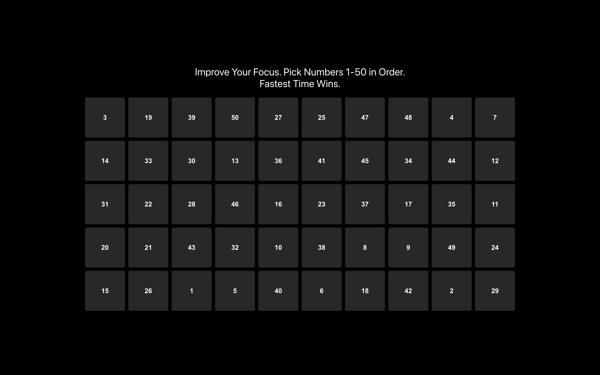
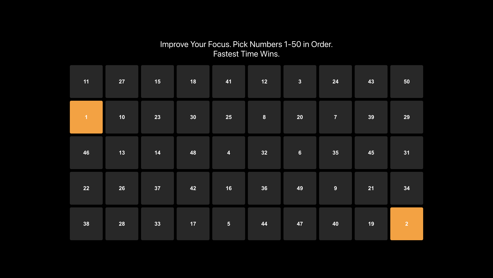
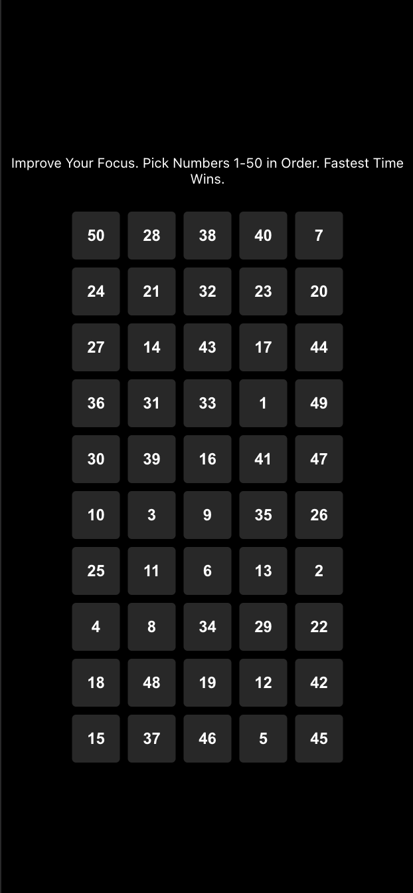
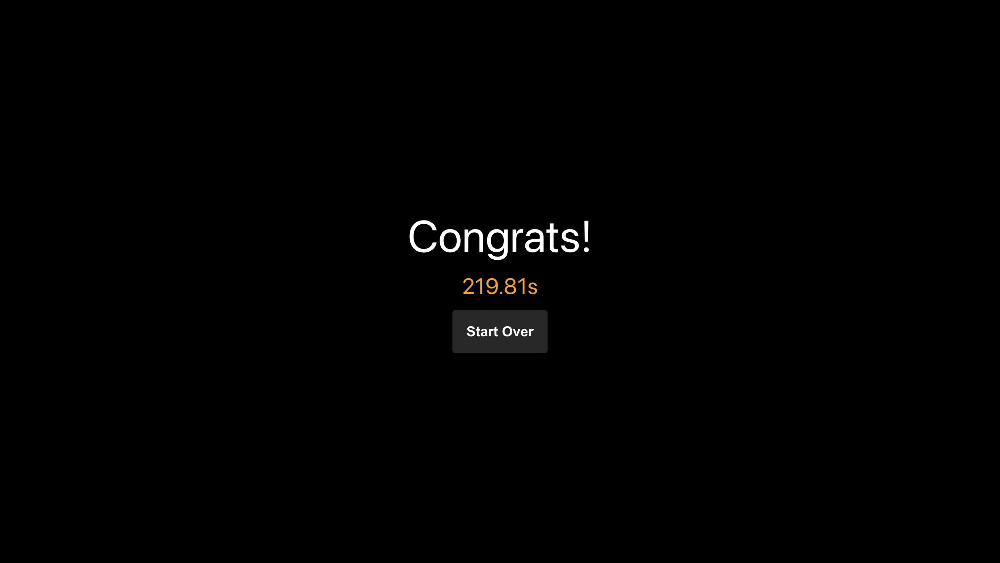
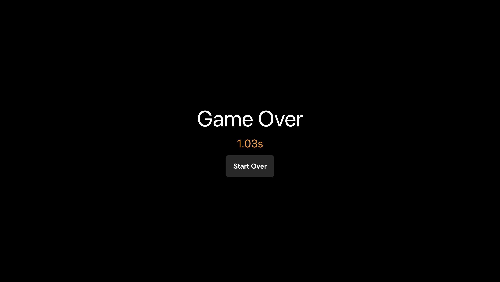

# Number Game Using React.js

### Screenshots

### Links

- Personal Webpage: [https://www.josiahparkhill.dev/](https://www.josiahparkhill.dev/)

### Built With

- React.js
- Semantic HTML5 markup
- CSS custom properties
- JavaScript
